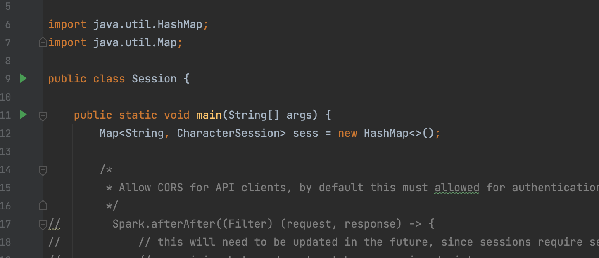

[](https://github.com/ngutn24/RollBuddy/actions/workflows/main.yml)
[](https://github.com/ngutn24/RollBuddy/actions/workflows/cd.yml)
[](https://github.com/ngutn24/RollBuddy/actions/workflows/pages/pages-build-deployment)

# RollBuddy User Manual

**RollBuddy is a virtual Dungeons and Dragons character sheet service that does most of the management associated with a pen-and-paper character sheet for you. It allows users to enter in all the important information such as character stats, skills, and gear and then calculates the roll modifiers and bonuses that are used for various actions in the game. It also allows users to roll various dice in the app so that they do not need to bring physical dice in order to play.**

**Compared to other existing DND character sheet services, RollBuddy is a much more straightforward service that helps you create your character quickly and get you rolling to play the game. Besides the essential functionality, the character's information is stored on the server like many other systems, so it is easier for the user to access it anywhere.**

## Running the application

To use RollBuddy, simply visit: https://ngutn24.github.io/RollBuddy/

If you wish to host the services yourself, please continue to the [following section](#software-installation-and-set-up) of this manual.

### Software installation and set up

To run this application, you will need to install the following software. Follow the links and download the appropriate version for your operating system:

- ### JAVA JDK version 8 or above (https://adoptium.net/temurin/releases/?version=11)

  In order to run **Gradle** and execute **Java** code of RollBuddy system, it requires at least **JAVA JDK version 8** or above. Follow the instructions in the link.

- ### Gradle version 7.1.1 or above (https://gradle.org/install/)
  **Gradle** will help you to install all other dependency Rollbuddy required. Running the `./gradlew` script for any task should install gradle. Follow the instructions in the link.

### Build and run the application

Clone the repository and change to the repo's directory:

```sh
git clone https://github.com/ngutn24/RollBuddy
cd RollBuddy
```

To run the backend, please run the following command:

```sh
./gradlew run_backend
```

_After_ starting the backend, the frontend can be executed by the following command from a separate terminal window or tab:

```sh
./gradlew run_frontend
```

You can now use the application by visiting [http://localhost:3000](http://localhost:3000) on your browser of choice. Enjoy, and please report any bugs you encounter ([see below](#How-to-report-a-bug)).

## How to report a bug

**We use GitHub issues to track our bugs!**

To report a bug, visit the issues page on the repository and create an issue using the **Bug Report** template

## Known bugs

[Github Bug Issues](https://github.com/ngutn24/RollBuddy/issues?q=is%3Aopen+is%3Aissue+label%3Abug)

## Features

- [x] Editing Sheet: Users can change the ability scores of their character, and it will reflect across the rest of the system (i.e. dice rolls, ability modification).

- [x] Persistent Data: If a user refreshes their page or closes their page and reopens, their character data will still be there.

- [x] Rolling Dice: Users can do dice rolls which is affected by their character's current stats. They can specify which attribute to use for their dice roll.

- [ ] Database Support: Character Sheets can exist in a DB non-volatile storage, meaning if the character is still held, the character can be pulled form a database.

- [ ] Account System: Users can have their own accounts which tie them to all the character sheets they have created.

# Developer Manual

## Repository Layout

The service is split into 2 systems:

### Frontend

This is where the user facing code will be held:

- What the user will interact with
- How it is presented to them, each individual part elements is break into part in the components file

### Backend

This is code involving information and systems not directly shown to the user:

- User Account System
- Campaign Ruleset System

Documentation for these two systems can be found in their READMEs:

- [Backend](/Backend/README.md)
- [Frontend](/frontend/README.md)

## Recommended IDEs

To conveniently edited, build and run the code, it is essential to have an IDE to handle those for you. There are a lot of choices, below are some suggestions. You could follow the download page instruction to install the corresponding version for your system:

- ### [Jetbrains IntelliJ](https://www.jetbrains.com/idea/download) (Backend)

  IntelliJ is one of the most powerful and popular Integrated Development Environments (IDE) for Java.

- ### [Visual studio Code](https://code.visualstudio.com/) (Backend + Frontend)
  Visual Studio Code is a code editor redefined and optimized for building and debugging modern web and cloud applications. Visual Studio Code is free and available on your favorite platform - Linux, macOS, and Windows.

## Building, Testing, and Executing

Rollbuddy uses **Gradle** to automate building, testing, and running the systems of
the platform

Each process of the workflow is handled by a gradle task(ex: `assemble`)

### Running gradle tasks

Gradle tasks can be executed by doing `./gradlew {task_name}`

### Building

Both frontend and backend have their own respective build tasks:

- `build_frontend`
- `build_backend`

But they can both be run with the `full_build` task

### Testing

Both frontend and backend have their own respective test tasks:

- `test_frontend`
- `test_backend`

But they can both be run with the `full_test` task

These test tasks will make sure everything is built first before running the test
suites

#### Adding to Backend

JUnit is used for testing backend code and is stored in `Backend/src/main/test/java`.
Adding new JUnit files in that directory will make sure those tests are run on the `test_backend` task

#### Adding to Frontend

All frontend code and resources can be found in the `frontend` folder. Note: if you are running any `npm` or `npx` commands, your current working directy must be the same `frontend` folder.

- Application code is found in `frontend/src`, with all components being contained in `frontend/src/components`.
- Assests such as logos and images are stored in `frontend/src/assets`.
- Tests are found alongside application code in `frontend/src` and `frontend/src/components`. For example, if you are writing tests for a JavaScript file named `Counter.js`, all tests covering that file should be in a file named `Counter.test.js` in the same directory.

For more information regarding frontend development, see the documentation [here](/frontend/README.md)

### Executing

Executing the systems of this service require different steps:

#### Frontend

1. The `build_frontend` task needs to be run, to create a static build
2. Running the `npm_start` task will run a local server

#### Backend

1. Run the `run_backend` Gradle task to start the backend.

_Alternatively_, you can run it in Intellij:

> Press the green button next to the `main` method in `Session.java` and the server will be executed:
> 
